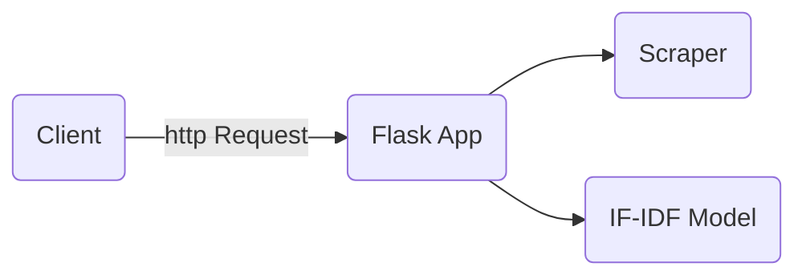

# Graphite test project
This application receive and url and returns the terms with the highest TF-IDF on the web page.



## TF-IDF endpoint

 Used to retrieve the terms with the highest TF-IDF on the page.

**URL** : `/tfidf/`

**Method** : `GET`

**Auth required** : NO

**Data constraints**

```json
{
    "url": "Url for the article (string)",
    "limit": "Limits the top feats to retrieve (integer)"
}
```

**Data example**

```json
{
    "username": "https://en.wikipedia.org/wiki/Donald_Trump",
    "password": "2"
}
```

### Success Response

**Code** : `200 OK`

**Content example**

```json
{
    "terms": [
        {
            "term": "retrieved",
            "tf-idf": 0.664
        },
        {
            "term": "2021",
            "tf-idf": 0.39
        }
    ]
}
```

### Error Response

**Condition** : If 'username' and 'password' combination is wrong.

**Code** : `400 BAD REQUEST`

**Content** :

```json
{
    "error": "Invalid URL: Missing parameters"
}
```


## Build
This project is developed using [python3.8](https://www.python.org/downloads/release/python-380/).

First, you should create an isolate python environment
```bash
python3 -m venv venv
source venv/bin/activate #environment activation
```
after the environment is builded and activated, install the python packages
```
pip install -r requirements.txt
```
## Running tests
Go to the root folder [/](/) and run
```bash
py.test
```

## Run application locally
Go to the root folder [app/](app/) and run
```
flask run
```
then, the flask server should be running on [http://127.0.0.1:5000](http://127.0.0.1:5000)

