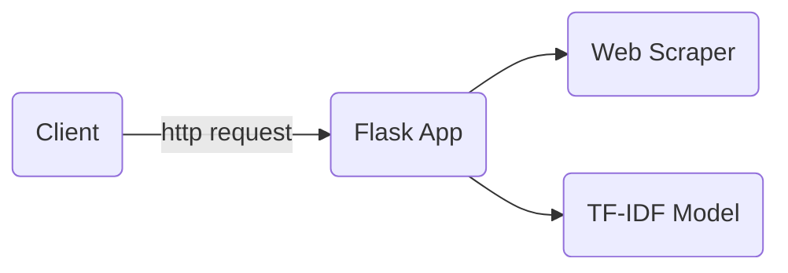

# Graphite project
## Table of contents  

- [Overview](#overview)
- [TF-IDF endpoint](#tfidfendpoint)
- [Build](#build)
- [Training](#training)
- [Tests](#tests)
- [Run application locally](#running)
- [References](#references)

## Overview <a name="overview"></a>

This application receive a url and returns the terms with the highest TF-IDF on a web page.

The application was developed using [Flask](https://flask.palletsprojects.com/en/2.1.x/) and is supported by two important features, a web scraper and a tfidf model. The web scraper takes and url and returns the text of the entire page while the tf-idf model takes the returned text and calculate the tf-idf features from it.
The tf-idf model was trained using the [sklearn TfidfVectorizer](https://scikit-learn.org/stable/modules/generated/sklearn.feature_extraction.text.TfidfVectorizer.html) on a large dataset of newspaper articles that falls between the years of 2016 and July 2017.

The following graphic shows the application components.



## TF-IDF endpoint <a name="tfidfendpoint"></a>

 Used to retrieve the terms with the highest TF-IDF on the page.

**URL** : `/tfidf/`

**Method** : `GET`

**Auth required** : No

**Parameters constraints**

```json
{
    "url": "Url of the article (string)",
    "limit": "Limits the top feats to retrieve (integer)"
}
```

**Parameters example**

```json
{
    "url": "https://en.wikipedia.org/wiki/Donald_Trump",
    "limit": "2"
}
```

### Success Response

**Code** : `200 OK`

**Content example**

```json
{
    "terms": [
        {
            "term": "retrieved",
            "tf-idf": 0.664
        },
        {
            "term": "2021",
            "tf-idf": 0.39
        }
    ]
}
```

### Error Response

**Condition** : If 'url' and 'limit' are not provided.

**Code** : `400 BAD REQUEST`

**Content** :

```json
{
    "error": "Invalid URL"
}
```


## Build <a name="build"></a>

This project is developed using [python3.8](https://www.python.org/downloads/release/python-380/) on [Ubuntu 20.04 LTS](https://releases.ubuntu.com/20.04/) and it depends of [virtualenv](https://packaging.python.org/en/latest/guides/installing-using-pip-and-virtual-environments/) to create virtual environments.

The [build.sh](build.sh) file have the commands for unpacking the model, build the python environment and installing dependencies. You can use as follows
```bash
sudo chmod +x build.sh
./build.sh
```
or do it manually you can execute the following commands
```bash
# Commands for unpacking the model
unzip app/models/models.zip -d app/models
unzip app/models/datasets.zip -d app/models
rm -r app/models/models.zip
rm -r app/models/datasets.zip
# Commands for building the python environment
python3 -m venv venv
source venv/bin/activate
# Command for installing dependencies
pip install -r requirements.txt
```

---
**NOTE**

For the next steps keep the python environment activated.

---

## Training <a name="training"></a>

The tf-idf model was trained using the [Sklearn TfidfVectorizer](https://scikit-learn.org/stable/modules/generated/sklearn.feature_extraction.text) library on the articles datasets from [https://www.kaggle.com/datasets/snapcrack/all-the-news](https://www.kaggle.com/datasets/snapcrack/all-the-news).

The [app/models/training.py](app/models/training.py) script contains the code with which the model was generated and you can retrain the model by running the following command:
```bash
python app/models/training.py
```
---
**NOTE**

It is very important to check that the article datasets are stored in the [app/models/data](app/models/data) folder before starting the training.

---
## Tests <a name="tests"></a>

To test the endpoint just run
```bash
py.test
```

## Run application locally <a name="running"></a>

Go to the [app/](app/) folder and run
```
flask run
```
then, the flask server should be running on [http://127.0.0.1:5000](http://127.0.0.1:5000). You can use the endpoint with the following command:
```bash
curl --request GET 'http://127.0.0.1:5000/tfidf?url=https://en.wikipedia.org/wiki/Donald_Trump&limit=2'
```


## References <a name="references"></a>

 - [Flask](https://flask.palletsprojects.com/en/2.1.x/)
 - [Sklearn TfidfVectorizer](https://scikit-learn.org/stable/modules/generated/sklearn.feature_extraction.text.TfidfVectorizer.html)
 - [Beautiful Soup](https://www.crummy.com/software/BeautifulSoup/bs4/doc/)
 - [TF(Term Frequency)-IDF(Inverse Document Frequency) in python.](https://towardsdatascience.com/tf-term-frequency-idf-inverse-document-frequency-from-scratch-in-python-6c2b61b78558)
