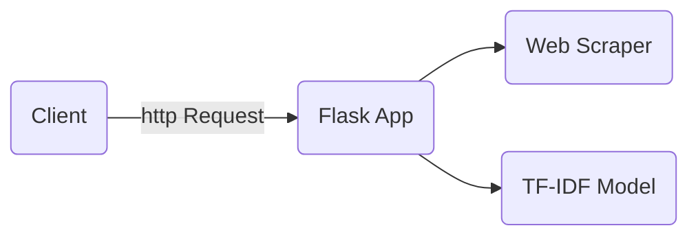

# Graphite test project
This application receive and url and returns the terms with the highest TF-IDF on the web page.

This application was developed using Flask and is supported by two important topics, the web scraper and the tfidf model. The web scraper takes and url and returns the text of the entire page while the tf-idf model is used to calculate the tf-idf features for the article.

The tf-idf model was trained using the [sklearn TfidfVectorizer](https://scikit-learn.org/stable/modules/generated/sklearn.feature_extraction.text.TfidfVectorizer.html) on a large dataset of newspaper articles that falls between the years of 2016 and July 2017. You can download the articles datasets from [https://www.kaggle.com/datasets/snapcrack/all-the-news](https://www.kaggle.com/datasets/snapcrack/all-the-news).

---
**NOTE**

It works with almost all markdown flavours (the below blank line matters).

---


## TF-IDF endpoint

 Used to retrieve the terms with the highest TF-IDF on the page.

**URL** : `/tfidf/`

**Method** : `GET`

**Auth required** : NO

**Parameters constraints**

```json
{
    "url": "Url for the article (string)",
    "limit": "Limits the top feats to retrieve (integer)"
}
```

**Parameters example**

```json
{
    "username": "https://en.wikipedia.org/wiki/Donald_Trump",
    "password": "2"
}
```

### Success Response

**Code** : `200 OK`

**Content example**

```json
{
    "terms": [
        {
            "term": "retrieved",
            "tf-idf": 0.664
        },
        {
            "term": "2021",
            "tf-idf": 0.39
        }
    ]
}
```

### Error Response

**Condition** : If 'username' and 'password' combination is wrong.

**Code** : `400 BAD REQUEST`

**Content** :

```json
{
    "error": "Invalid URL: Missing parameters"
}
```


## Build
This project is developed using [python3.8](https://www.python.org/downloads/release/python-380/).

First, you should create an isolate python environment
```bash
python3 -m venv venv
source venv/bin/activate #environment activation
```
after the environment is builded and activated, install the python packages
```
pip install -r requirements.txt
```
## Running tests
Go to the root folder [/](/) and run
```bash
py.test
```

## Run application locally
Go to the root folder [app/](app/) and run
```
flask run
```
then, the flask server should be running on [http://127.0.0.1:5000](http://127.0.0.1:5000)


## References
 - [Flask](https://flask.palletsprojects.com/en/2.1.x/)
 - [Sklearn TfidfVectorizer](https://scikit-learn.org/stable/modules/generated/sklearn.feature_extraction.text.TfidfVectorizer.html)
 - [Beautiful Soup](https://www.crummy.com/software/BeautifulSoup/bs4/doc/)
 - [TF(Term Frequency)-IDF(Inverse Document Frequency) from scratch in python.](https://towardsdatascience.com/tf-term-frequency-idf-inverse-document-frequency-from-scratch-in-python-6c2b61b78558)